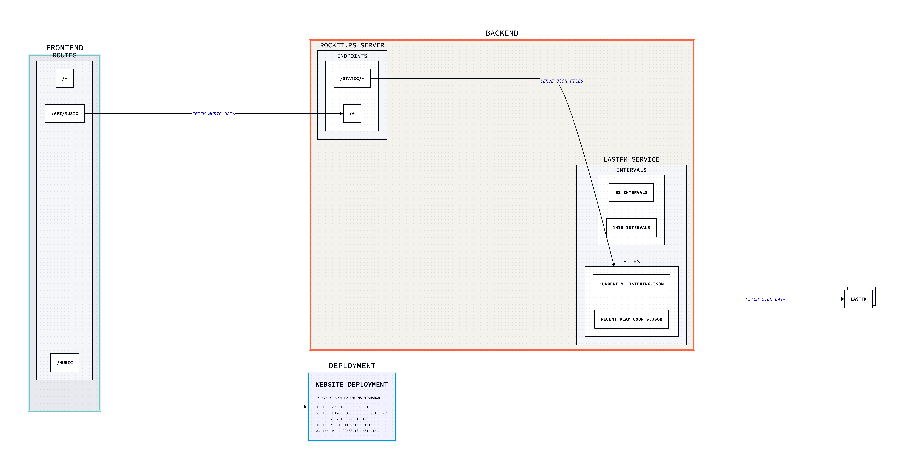

# My simple website.

## Stack
- [Svelte](https://svelte.dev/)
- [SvelteKit](https://kit.svelte.dev/)
- [Biome](https://biomejs.dev/)
- [GSAP](https://greensock.com/gsap/) - For smooth animations
- [Sass](https://sass-lang.com/) - For enhanced styling
- [TypeScript](https://www.typescriptlang.org/) - For type safety
- [Zod](https://zod.dev/) - For runtime type validation

## Deployment
The website is automatically deployed using GitHub Actions. On every push to the main branch:
1. The code is checked out
2. The changes are pulled on the VPS
3. Dependencies are installed
4. The application is built
5. The PM2 process is restarted

## Cool things
- [Header Theme Switcher](./src/lib/components/Header.svelte)

    The changing button rotates on hover and fully rotates on click.
    The issue was that if the button hover was exited before the rotation was complete,the button would rotate back to its original positio, in a very jarring way.

- [Footer Link](./src/lib/components/Footer.svelte)

    The SVG external link icon was cool to tweak in order to animate it on hover.

- [Magnetik Component](./src/lib/components/Magnetik.svelte)

    A configurable magnetic field effect that attracts elements towards the mouse cursor. Features adjustable field size and force, with a debug mode that visualizes the magnetic field boundaries.

- [Custom Cursor](./src/lib/components/Cursor.svelte)

  A spring physics-based custom cursor that smoothly follows mouse movement. Fully customizable with support for
  scaling, opacity, blur effects, and the ability to display SVGs or text inside it on hover.
  Includes [its own actions](./src/lib/actions/cursor.ts) (`use:cursorEnter`
  and `use:cursorLeave`) for easily adding hover interactions to any element, with configurable parameters for
  scale, opacity, and content changes.
  It only appears on desktop devices and when the mouse has moved to avoid appearing on page load.

- [Interactive Background Canvas](./src/lib/components/BackgroundCanvas.svelte)

  A WebGL-powered interactive background featuring Bayer dithering effects. Click anywhere on the background to generate expanding wave rings with retro pixelated aesthetics. Uses fragment shaders for GPU-accelerated rendering and supports up to 10 simultaneous wave effects with configurable speed, thickness, and attenuation parameters.
  
  *Inspired by the techniques described in [Interactive WebGL Backgrounds: A Quick Guide to Bayer Dithering](https://tympanus.net/codrops/2025/07/30/interactive-webgl-backgrounds-a-quick-guide-to-bayer-dithering/) on Codrops.*

## Backend Infrastructure
The website is powered by two custom Rust services:

### API Server ([vps-back](https://github.com/TomPlanche/vps-back))
- Built with Rocket.rs framework
- Provides RESTful API endpoints
- Handles CORS and static file serving
- Serves data for the music section

### LastFM Integration ([vps-lastfm](https://github.com/TomPlanche/vps-lastfm))
A dedicated service that:
- Fetches real-time LastFM listening data
- Tracks currently playing song (5-second intervals)
- Stores last 100 played tracks (1-minute intervals)
- Outputs structured JSON data consumed by the API server

## Architecture Diagram
The architecture diagram is generated using [D2](https://d2lang.com/).

## Acknowledgements
### Fonts
- [iA Writer Duospace](https://github.com/iaolo/iA-Fonts)